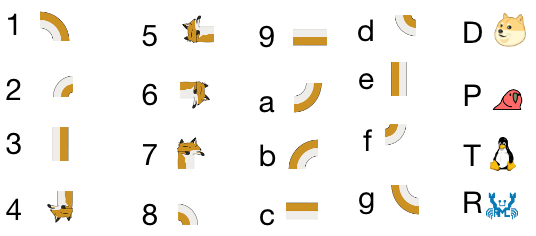

# 絵文字の組み合わせがちょっとだけ楽になるツール

## 対応表

## 動作環境

* Perl5.6.1以上 (Linux,macOS などにはたいてい標準で入っています)
* パイプの使えるシェル (bashなど)

## 使用例

	$ cat example1.txt | ./oekaki.pl

macOSだと、以下の方法でクリップボードにコピーできます。

	$ cat example1.txt | ./oekaki.pl | pbcopy

